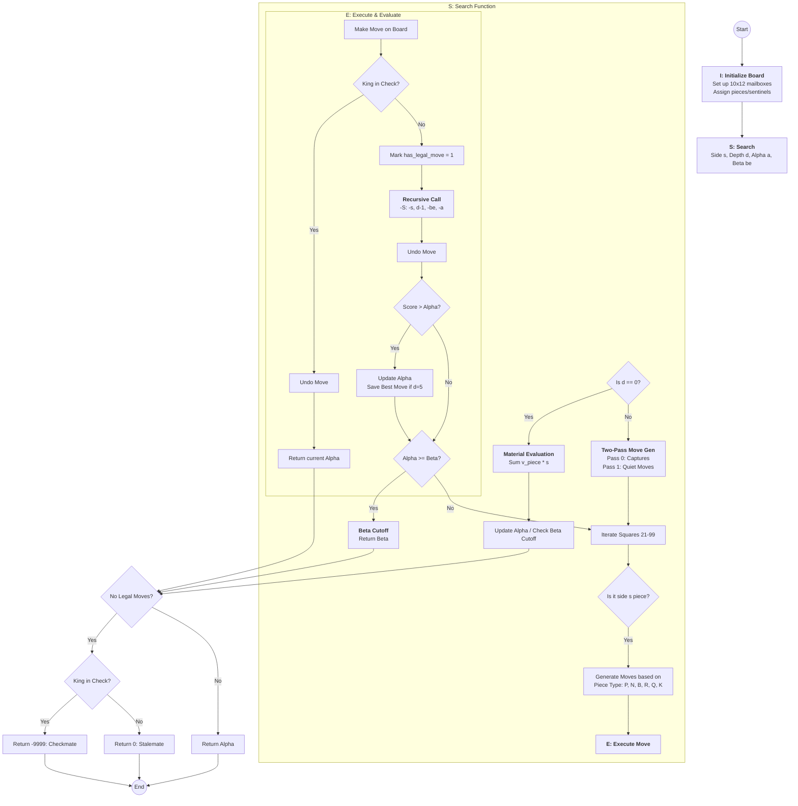

## writeup

I made a readable version `sameshi.h`, with comments explaining the code.

### flowchart

```mermaid
graph TD
    Start((Start)) --> Init[<b>I: Initialize Board</b><br/>Set up 10x12 mailboxes<br/>Assign pieces/sentinels]
    Init --> CallS[<b>S: Search</b><br/>Side s, Depth d, Alpha a, Beta be]
    
    subgraph Search_Function [S: Search Function]
        Leaf{Is d == 0?}
        Leaf -- Yes --> Eval[<b>Material Evaluation</b><br/>Sum v_piece * s]
        Eval --> AlphaUpdate1[Update Alpha / Check Beta Cutoff]
        
        Leaf -- No --> PassLoop[<b>Two-Pass Move Gen</b><br/>Pass 0: Captures<br/>Pass 1: Quiet Moves]
        
        PassLoop --> PieceIter[Iterate Squares 21-99]
        PieceIter --> SideCheck{Is it side s piece?}
        
        SideCheck -- Yes --> MoveGen[Generate Moves based on<br/>Piece Type: P, N, B, R, Q, K]
        MoveGen --> CallE[<b>E: Execute Move</b>]
        
        subgraph Execute_Function [E: Execute & Evaluate]
            Make[Make Move on Board] --> CheckCheck{King in Check?}
            CheckCheck -- Yes --> Undo1[Undo Move]
            Undo1 --> ReturnA[Return current Alpha]
            
            CheckCheck -- No --> Legal[Mark has_legal_move = 1]
            Legal --> Recurse[<b>Recursive Call</b><br/>-S: -s, d-1, -be, -a]
            Recurse --> Undo2[Undo Move]
            Undo2 --> ScoreCheck{Score > Alpha?}
            ScoreCheck -- Yes --> UpdateA[Update Alpha<br/>Save Best Move if d=5]
            ScoreCheck -- No --> BetaCheck
            UpdateA --> BetaCheck{Alpha >= Beta?}
        end
        
        BetaCheck -- Yes --> BetaCutoff[<b>Beta Cutoff</b><br/>Return Beta]
        BetaCheck -- No --> PieceIter
    end

    BetaCutoff --> FinalCheck
    ReturnA --> FinalCheck
    AlphaUpdate1 --> FinalCheck

    FinalCheck{No Legal Moves?}
    FinalCheck -- Yes --> MateCheck{King in Check?}
    MateCheck -- Yes --> ResMate[Return -9999: Checkmate]
    MateCheck -- No --> ResStale[Return 0: Stalemate]
    
    FinalCheck -- No --> ReturnAlpha[Return Alpha]
    
    ResMate --> End((End))
    ResStale --> End
    ReturnAlpha --> End
```

> [!WARNING]
> the diagram above was generated using Gemini 3. 